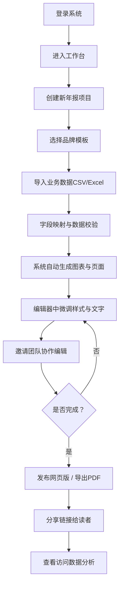
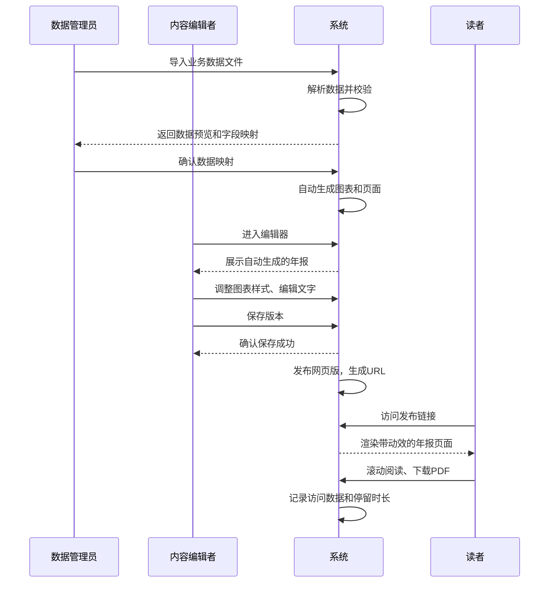

## 1. 产品概述

企业年度报告数据可视化生成工具，帮助企业财务和品牌部门快速将业务数据转化为专业、美观的年度报告。通过数据导入、模板选择、自动生成图表、协作编辑、多格式发布和数据分析追踪，大幅提升年报制作效率和质量。

- 核心目标用户：企业财务部门、品牌市场部门、战略规划团队
- 市场价值：降低年报制作的技术门槛，缩短制作周期，提升报告专业度和品牌一致性

## 2. 核心功能

### 2.1 用户角色与权限

| 角色 | 核心权限 |
|------|----------|
| 数据管理员 | 导入/修改原始数据、管理数据源、管理用户权限 |
| 内容编辑者 | 编辑文字内容、调整图表样式、添加说明段落 |
| 普通读者 | 查看已发布年报、下载PDF |
| 系统管理员 | 全部权限、团队管理、数据统计 |

### 2.2 功能模块

1. **工作台首页**：项目列表、模板库、最近编辑、快捷操作
2. **数据导入中心**：CSV/Excel导入、数据预览校验、字段映射、数据同步更新
3. **年报编辑器**：页面结构管理、图表拖拽布局、文字编辑、样式微调面板
4. **品牌模板中心**：预设模板库、自定义主题色、字体管理、品牌Logo配置
5. **图表组件库**：折线图、柱状图、饼图、数字卡片、地图热力图、进度条、表格
6. **协作管理**：团队成员邀请、角色分配、实时协同编辑、版本历史
7. **发布中心**：网页版发布（带动效）、静态PDF导出、分享链接管理
8. **数据分析面板**：访问量统计、停留时长分布、页面热力分析、读者画像

### 2.3 页面详情

| 页面名称 | 模块名称 | 功能描述 |
|-----------|-------------|---------------------|
| 工作台首页 | 项目概览区 | 展示所有年报项目卡片，显示状态、最近编辑时间、操作按钮 |
| 工作台首页 | 模板精选区 | 横向滚动展示预设品牌模板，支持快速创建 |
| 工作台首页 | 数据看板 | 总项目数、总访问量、团队成员概览 |
| 数据导入页 | 文件上传区 | 拖拽上传CSV/Excel，支持格式校验和错误提示 |
| 数据导入页 | 字段映射配置 | 自动识别字段名，支持手动调整数据列映射 |
| 数据导入页 | 数据预览表格 | 展示导入数据前50行，支持数据校验和标记异常 |
| 年报编辑器 | 左侧页面导航 | 章节和页面列表，支持拖拽排序和增删 |
| 年报编辑器 | 中间画布区 | 实时预览年报效果，支持拖拽组件和调整布局 |
| 年报编辑器 | 右侧属性面板 | 图表样式配置、文字编辑、动画效果设置 |
| 年报编辑器 | 顶部工具栏 | 保存、预览、撤销/重做、缩放、切换模板 |
| 模板中心 | 模板网格 | 展示所有预设模板缩略图，带筛选和分类 |
| 模板中心 | 自定义主题 | 品牌色配置器、字体选择器、Logo上传 |
| 协作管理页 | 成员列表 | 团队成员卡片，显示角色、状态、权限标识 |
| 协作管理页 | 邀请面板 | 邮箱邀请链接、批量导入、角色分配 |
| 协作管理页 | 版本历史 | 记录每次保存的版本，支持对比和回滚 |
| 发布中心页 | 发布配置 | 网页版动效开关、SEO设置、访问密码、有效期 |
| 发布中心页 | 导出选项 | PDF尺寸选择、质量设置、封面/目录/水印配置 |
| 发布中心页 | 发布状态 | 发布URL、二维码、访问次数统计 |
| 数据分析页 | 总览指标卡 | 总访问量、独立访客、平均停留时长、完成阅读率 |
| 数据分析页 | 访问趋势图 | 按日/周/月展示访问量变化趋势折线图 |
| 数据分析页 | 页面停留分布 | 滚动深度热力图，展示各章节停留时长分布 |
| 数据分析页 | 读者来源分析 | 地域分布、设备类型、流量来源 |

## 3. 核心流程

## 4. 用户界面设计

### 4.1 设计风格

- **设计理念**：专业商务风格 + 数据可视化美学，强调信息层级和品牌一致性
- **主色调**：深邃蓝 `#1e3a5f` 作为主色，搭配高级金 `#c9a962` 作为强调色
- **辅助色**：数据渐变色谱（蓝→青→绿→黄→橙→红）用于图表数据区分
- **背景色**：编辑器界面使用浅灰 `#f8fafc`，发布页面支持模板自定义
- **字体**：标题使用 Cormorant Garamond（衬线，优雅专业），正文使用 Manrope（无衬线，清晰易读）
- **按钮风格**：圆角8px，主按钮采用渐变背景+微妙阴影，悬停有浮起效果
- **布局风格**：三栏布局编辑器（左导航+中画布+右属性），卡片式信息承载
- **图标风格**：Lucide 线框图标，统一 1.5px 线条粗细

### 4.2 页面设计概述

| 页面名称 | 模块名称 | UI元素风格 |
|-----------|-------------|-------------|
| 工作台首页 | 项目概览区 | 大型项目卡片，封面缩略图+状态徽章+悬浮操作菜单 |
| 工作台首页 | 模板精选区 | 横向滚动卡片，悬停放大+快速应用按钮 |
| 数据导入页 | 文件上传区 | 虚线边框上传区域，拖拽进入时边框变色+背景微光 |
| 数据导入页 | 数据预览表格 | 斑马纹+冻结表头，异常数据红色高亮标注 |
| 年报编辑器 | 中间画布区 | 白色画布带阴影，A4比例，滚动进入时元素渐入动画 |
| 年报编辑器 | 右侧属性面板 | 分组折叠面板，颜色选择器带品牌色预设 |
| 模板中心 | 模板网格 | 2列网格布局，模板预览图带hover动效 |
| 发布中心页 | 发布状态卡 | 渐变背景卡片，二维码+URL一键复制 |
| 数据分析页 | 总览指标卡 | 4色渐变卡片，数字带动态计数动画 |
| 数据分析页 | 页面停留分布 | 纵向热力条，颜色深浅代表停留时长，悬浮显示精确数值 |

### 4.3 响应式设计

- **桌面端优先**：核心编辑器优化1920×1080及以上分辨率
- **平板适配**：右侧属性面板改为可折叠抽屉，画布自适应缩放
- **手机端**：工作台、发布页、数据分析页完全适配，编辑器建议桌面使用
- **发布页面**：长滚动单页完全响应式，图表在移动端自适应宽度

### 4.4 动效设计

- **页面加载**：分区块渐入动画，图表使用stagger延迟依次出现
- **数据可视化动效**：数字卡片滚动计数、柱状图从底部生长、折线图路径绘制动画
- **交互反馈**：按钮按下缩放、卡片悬停浮起、滑块拖动实时预览
- **滚动触发**：发布页面使用 Intersection Observer，内容滚动到视口时触发动画
- **转场动效**：页面切换使用淡入淡出+轻微位移（200ms ease-out）
