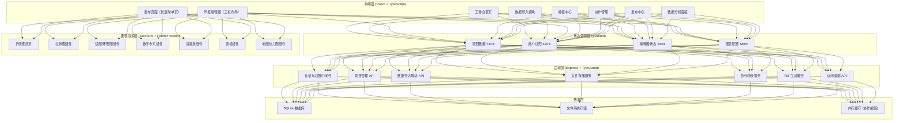
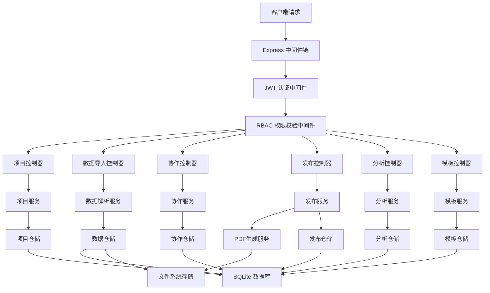
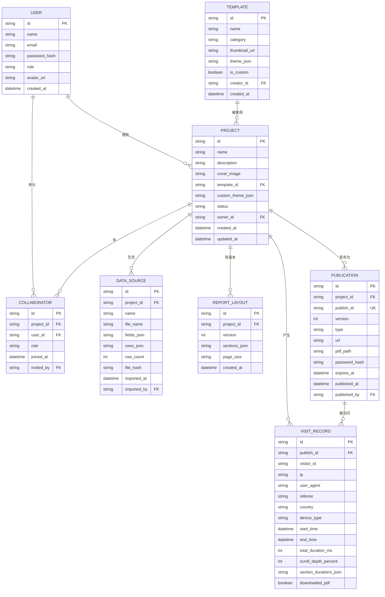

## 1. 架构设计



## 2. 技术描述

- **前端框架**：React 18 + TypeScript 5 + Vite 5
- **后端框架**：Express 4 + TypeScript
- **初始化工具**：vite-init（react-express-ts 模板）
- **UI 样式**：Tailwind CSS 3
- **状态管理**：Zustand
- **路由管理**：React Router v6
- **图表库**：Recharts（数据可视化）
- **动效库**：Framer Motion（页面转场、交互动效、滚动动画）
- **文件解析**：xlsx（Excel解析）、papaparse（CSV解析）
- **PDF生成**：jspdf + html2canvas（前端导出），后端可选 puppeteer
- **图标库**：Lucide React
- **数据库**：SQLite（通过 better-sqlite3 驱动），本地开发无需外部服务
- **二维码生成**：qrcode.react
- **富文本编辑**：自定义轻量级编辑器（支持基础格式化）

## 3. 路由定义

### 前端路由

| 路由路径 | 页面组件 | 页面用途 | 权限要求 |
|----------|----------|----------|----------|
| `/login` | LoginPage | 登录页 | 公开 |
| `/` | DashboardPage | 工作台首页 | 已登录 |
| `/projects/create` | CreateProjectPage | 创建新年报项目 | 已登录 |
| `/projects/:id/data-import` | DataImportPage | 数据导入与映射配置 | 数据管理员+ |
| `/projects/:id/editor` | EditorPage | 年报编辑器主界面 | 内容编辑者+ |
| `/templates` | TemplateCenterPage | 品牌模板中心 | 已登录 |
| `/projects/:id/collaboration` | CollaborationPage | 协作管理与权限配置 | 数据管理员+ |
| `/projects/:id/publish` | PublishPage | 发布中心（网页+PDF） | 内容编辑者+ |
| `/projects/:id/analytics` | AnalyticsPage | 访问数据分析面板 | 数据管理员+ |
| `/view/:publishId` | ViewReportPage | 发布后的年报浏览页 | 公开（可设密码） |

### 后端 API 路由

| 方法 | 路由路径 | 功能描述 |
|------|----------|----------|
| POST | `/api/auth/login` | 用户登录 |
| GET | `/api/auth/me` | 获取当前用户信息 |
| GET | `/api/projects` | 获取项目列表 |
| POST | `/api/projects` | 创建新项目 |
| GET | `/api/projects/:id` | 获取项目详情 |
| PUT | `/api/projects/:id` | 更新项目配置 |
| POST | `/api/projects/:id/import` | 导入数据文件（CSV/Excel） |
| GET | `/api/projects/:id/data` | 获取项目数据源 |
| PUT | `/api/projects/:id/layout` | 保存页面布局配置 |
| GET | `/api/templates` | 获取所有品牌模板 |
| POST | `/api/templates/custom` | 保存自定义模板 |
| GET | `/api/projects/:id/collaborators` | 获取协作者列表 |
| POST | `/api/projects/:id/collaborators` | 邀请协作者 |
| PUT | `/api/projects/:id/collaborators/:userId` | 修改协作者权限 |
| POST | `/api/projects/:id/publish/web` | 发布网页版年报 |
| POST | `/api/projects/:id/export/pdf` | 触发PDF导出 |
| GET | `/api/publish/:publishId` | 获取发布内容 |
| POST | `/api/publish/:publishId/track` | 上报访问数据 |
| GET | `/api/projects/:id/analytics` | 获取统计数据 |

## 4. 核心数据类型定义

```typescript
// shared/types/index.ts

export interface User {
  id: string;
  name: string;
  email: string;
  avatar?: string;
  role: 'admin' | 'data_manager' | 'editor' | 'viewer';
  createdAt: Date;
}

export interface Project {
  id: string;
  name: string;
  description?: string;
  coverImage?: string;
  templateId: string;
  customTheme?: ThemeConfig;
  status: 'draft' | 'published';
  ownerId: string;
  createdAt: Date;
  updatedAt: Date;
  lastEditedBy?: string;
}

export interface ThemeConfig {
  primaryColor: string;
  secondaryColor: string;
  accentColor: string;
  backgroundColor: string;
  textColor: string;
  headingFont: string;
  bodyFont: string;
  borderRadius: 'sm' | 'md' | 'lg' | 'xl';
  shadowIntensity: 'none' | 'light' | 'medium' | 'strong';
}

export interface DataSource {
  id: string;
  projectId: string;
  name: string;
  fileName: string;
  fields: DataField[];
  rows: Record<string, any>[];
  importedAt: Date;
  importedBy: string;
  rowCount: number;
  fileHash: string;
}

export interface DataField {
  key: string;
  label: string;
  type: 'string' | 'number' | 'date' | 'currency' | 'percentage';
  mappedFrom?: string;
}

export interface ChartConfig {
  id: string;
  type: 'line' | 'bar' | 'pie' | 'number' | 'progress' | 'table' | 'map';
  title: string;
  subtitle?: string;
  dataSourceId: string;
  xField?: string;
  yFields?: string[];
  valueField?: string;
  labelField?: string;
  aggregation?: 'sum' | 'avg' | 'count' | 'max' | 'min';
  styleConfig: ChartStyleConfig;
  width: 'full' | 'half' | 'third' | 'quarter';
}

export interface ChartStyleConfig {
  colorPalette: string[];
  showLegend: boolean;
  showGrid: boolean;
  showLabels: boolean;
  animationEnabled: boolean;
  strokeWidth: number;
  barRadius: number;
  fontFamily: string;
}

export interface PageSection {
  id: string;
  type: 'cover' | 'toc' | 'content' | 'chart' | 'text' | 'divider';
  title?: string;
  subtitle?: string;
  content?: string;
  charts?: ChartConfig[];
  templateVariant?: number;
  backgroundStyle?: string;
}

export interface ReportLayout {
  projectId: string;
  version: number;
  sections: PageSection[];
  pageSize: 'A4' | 'Letter' | 'Web';
  createdAt: Date;
}

export interface Collaborator {
  userId: string;
  projectId: string;
  role: 'data_manager' | 'editor' | 'viewer';
  joinedAt: Date;
  invitedBy: string;
}

export interface Publication {
  id: string;
  projectId: string;
  publishId: string;
  version: number;
  type: 'web' | 'pdf';
  url?: string;
  pdfPath?: string;
  password?: string;
  expiresAt?: Date;
  publishedAt: Date;
  publishedBy: string;
}

export interface VisitRecord {
  id: string;
  publishId: string;
  visitorId: string;
  ip?: string;
  userAgent?: string;
  referrer?: string;
  country?: string;
  deviceType?: 'desktop' | 'mobile' | 'tablet';
  startTime: Date;
  endTime?: Date;
  totalDuration: number;
  scrollDepth: number;
  sectionDurations: Record<string, number>;
  downloadedPdf: boolean;
}
```

## 5. 服务器架构图



## 6. 数据模型

### 6.1 实体关系图



### 6.2 数据库 DDL

```sql
-- 用户表
CREATE TABLE users (
    id TEXT PRIMARY KEY,
    name TEXT NOT NULL,
    email TEXT NOT NULL UNIQUE,
    password_hash TEXT NOT NULL,
    role TEXT NOT NULL DEFAULT 'viewer' CHECK (role IN ('admin', 'data_manager', 'editor', 'viewer')),
    avatar_url TEXT,
    created_at DATETIME NOT NULL DEFAULT CURRENT_TIMESTAMP
);

-- 项目表
CREATE TABLE projects (
    id TEXT PRIMARY KEY,
    name TEXT NOT NULL,
    description TEXT,
    cover_image TEXT,
    template_id TEXT,
    custom_theme_json TEXT,
    status TEXT NOT NULL DEFAULT 'draft' CHECK (status IN ('draft', 'published')),
    owner_id TEXT NOT NULL REFERENCES users(id),
    created_at DATETIME NOT NULL DEFAULT CURRENT_TIMESTAMP,
    updated_at DATETIME NOT NULL DEFAULT CURRENT_TIMESTAMP,
    last_edited_by TEXT REFERENCES users(id)
);

-- 协作者表
CREATE TABLE collaborators (
    id TEXT PRIMARY KEY,
    project_id TEXT NOT NULL REFERENCES projects(id) ON DELETE CASCADE,
    user_id TEXT NOT NULL REFERENCES users(id) ON DELETE CASCADE,
    role TEXT NOT NULL CHECK (role IN ('data_manager', 'editor', 'viewer')),
    joined_at DATETIME NOT NULL DEFAULT CURRENT_TIMESTAMP,
    invited_by TEXT NOT NULL REFERENCES users(id),
    UNIQUE(project_id, user_id)
);

-- 数据源表
CREATE TABLE data_sources (
    id TEXT PRIMARY KEY,
    project_id TEXT NOT NULL REFERENCES projects(id) ON DELETE CASCADE,
    name TEXT NOT NULL,
    file_name TEXT NOT NULL,
    fields_json TEXT NOT NULL,
    rows_json TEXT NOT NULL,
    row_count INTEGER NOT NULL DEFAULT 0,
    file_hash TEXT NOT NULL,
    imported_at DATETIME NOT NULL DEFAULT CURRENT_TIMESTAMP,
    imported_by TEXT NOT NULL REFERENCES users(id)
);

-- 报告布局版本表
CREATE TABLE report_layouts (
    id TEXT PRIMARY KEY,
    project_id TEXT NOT NULL REFERENCES projects(id) ON DELETE CASCADE,
    version INTEGER NOT NULL,
    sections_json TEXT NOT NULL,
    page_size TEXT NOT NULL DEFAULT 'A4',
    created_at DATETIME NOT NULL DEFAULT CURRENT_TIMESTAMP,
    UNIQUE(project_id, version)
);

-- 模板表
CREATE TABLE templates (
    id TEXT PRIMARY KEY,
    name TEXT NOT NULL,
    category TEXT NOT NULL DEFAULT 'general',
    thumbnail_url TEXT,
    theme_json TEXT NOT NULL,
    is_custom INTEGER NOT NULL DEFAULT 0,
    creator_id TEXT REFERENCES users(id),
    created_at DATETIME NOT NULL DEFAULT CURRENT_TIMESTAMP
);

-- 发布记录表
CREATE TABLE publications (
    id TEXT PRIMARY KEY,
    project_id TEXT NOT NULL REFERENCES projects(id) ON DELETE CASCADE,
    publish_id TEXT NOT NULL UNIQUE,
    version INTEGER NOT NULL DEFAULT 1,
    type TEXT NOT NULL CHECK (type IN ('web', 'pdf')),
    url TEXT,
    pdf_path TEXT,
    password_hash TEXT,
    expires_at DATETIME,
    published_at DATETIME NOT NULL DEFAULT CURRENT_TIMESTAMP,
    published_by TEXT NOT NULL REFERENCES users(id)
);

-- 访问记录表
CREATE TABLE visit_records (
    id TEXT PRIMARY KEY,
    publish_id TEXT NOT NULL REFERENCES publications(publish_id) ON DELETE CASCADE,
    visitor_id TEXT NOT NULL,
    ip TEXT,
    user_agent TEXT,
    referrer TEXT,
    country TEXT,
    device_type TEXT,
    start_time DATETIME NOT NULL,
    end_time DATETIME,
    total_duration_ms INTEGER NOT NULL DEFAULT 0,
    scroll_depth_percent INTEGER NOT NULL DEFAULT 0,
    section_durations_json TEXT,
    downloaded_pdf INTEGER NOT NULL DEFAULT 0
);

-- 索引
CREATE INDEX idx_projects_owner ON projects(owner_id);
CREATE INDEX idx_collaborators_user ON collaborators(user_id);
CREATE INDEX idx_data_sources_project ON data_sources(project_id);
CREATE INDEX idx_publications_project ON publications(project_id);
CREATE INDEX idx_visit_records_publish ON visit_records(publish_id);
CREATE INDEX idx_visit_records_time ON visit_records(start_time);
```
